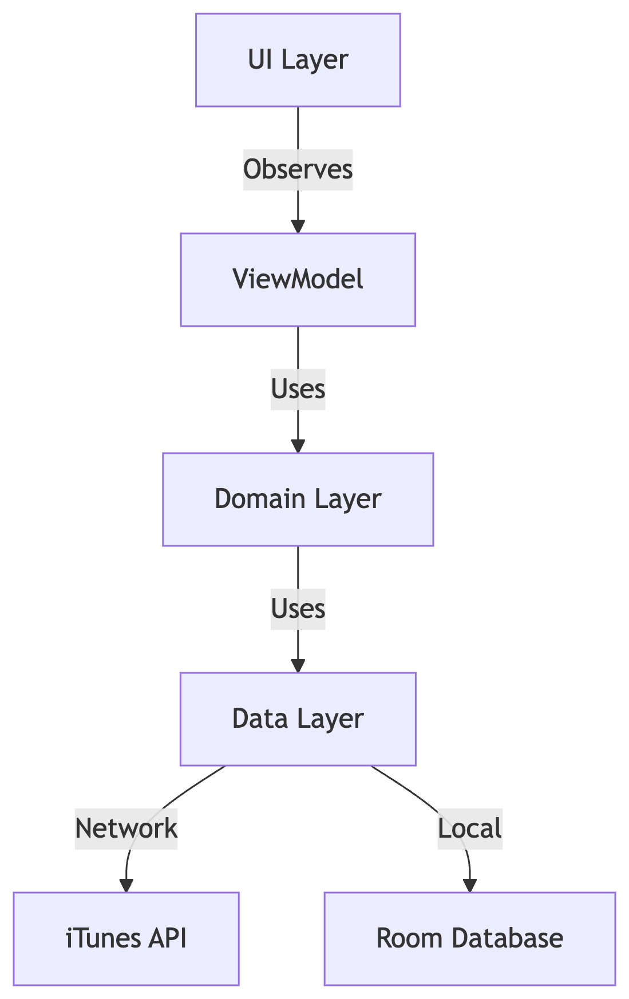

# Playlist Maker - Android Application

[](https://kotlinlang.org)
[](https://opensource.org/licenses/MIT)

Playlist Maker is a modern Android application that allows users to create, manage, and share music playlists using tracks from the iTunes API. Built with Kotlin and following best practices in Android development, this app provides a seamless experience for music enthusiasts.

## 📱 Features

- 🔍 **Search for music tracks** with cover art, artist, and duration
- ❤️ **Add tracks to favorites** for quick access
- 🎧 **Create and view playlists** with custom images
- 🎵 **Audio player** with preview functionality
- 🕶 **Dark theme support** for comfortable nighttime use
- 🤝 **Share playlists** or contact support
- 🧹 **Clear search history** with one tap
- 📁 **Track organization** with metadata display

## 📸 Screenshots

| Search Screen | Track Details | Playlists |
|:-------------:|:-------------:|:---------:|
|  |  |  |

## Tech Stack

- **Language:** Kotlin
- **Architecture:** MVVM with Clean Architecture
- **Dependency Injection:** Koin
- **Local Storage:** Room Database
- **Networking:** Retrofit + Gson
- **Asynchronous:** Kotlin Coroutines + Flow
- **Image Loading:** Glide
- **UI:** XML layouts with Material Design
- **Navigation:** Android Navigation Component

## Project Structure

```
com.example.playlistmaker
├── di                # Dependency injection modules
├── main              # App entry point
├── media             # Media library functionality
│   ├── data          # Data layer (DB, repositories)
│   ├── domain        # Business logic
│   └── ui            # UI components
├── player            # Audio player implementation
├── search            # Search functionality
├── settings          # App settings
├── sharing           # Sharing functionality
└── util              # Utilities and extensions
```

## Getting Started

### Prerequisites
- Android Studio Arctic Fox (2020.3.1) or newer
- Android SDK 31+
- Java 11+

### Installation
1. Clone the repository:
```bash
git clone https://github.com/Nadezhda-Gurova/Playlist_Maker.git
```

2. Open the project in Android Studio

3. Build and run the app on an emulator or device (Android 8.0+)

## Architecture

The application follows the **MVVM (Model-View-ViewModel)** pattern with **Clean Architecture** principles:



```
UI Layer → ViewModel → Domain Layer (Use Cases) → Data Layer
                      (Interactors)             ├── Local (Room DB)
                                               └── Remote (iTunes API)
```

Data flow:
1. UI triggers actions in ViewModel
2. ViewModel executes Use Cases (Interactors)
3. Use Cases retrieve data from Repositories
4. Repositories combine data from local and remote sources
5. Data flows back to UI through observable components (LiveData/StateFlow)

## Key Components

### Data Layer
- **Room Database:** Local storage for favorites and playlists
- **Retrofit:** API communication with iTunes
- **SharedPreferences:** Persistent storage for settings

### Domain Layer
- **Interactors:** Business logic handlers
- **Repositories:** Abstraction between data sources and business logic
- **Models:** Data structures for tracks and playlists

### UI Layer
- **ViewModel:** Manages UI-related data
- **LiveData/StateFlow:** Observable data holders
- **RecyclerView:** Efficient lists for tracks and playlists
- **Fragments:** Modular UI components

## Contributing

Contributions are welcome! Please follow these steps:
1. Fork the project
2. Create your feature branch (`git checkout -b feature/AmazingFeature`)
3. Commit your changes (`git commit -m 'Add some AmazingFeature'`)
4. Push to the branch (`git push origin feature/AmazingFeature`)
5. Open a pull request

## License

Distributed under the MIT License. See `LICENSE` for more information.

## Contact

Project Maintainer: Nadezhda Gurova  
Email: nyud91@gmail.com  
Project Link: https://github.com/Nadezhda-Gurova/Playlist_Maker